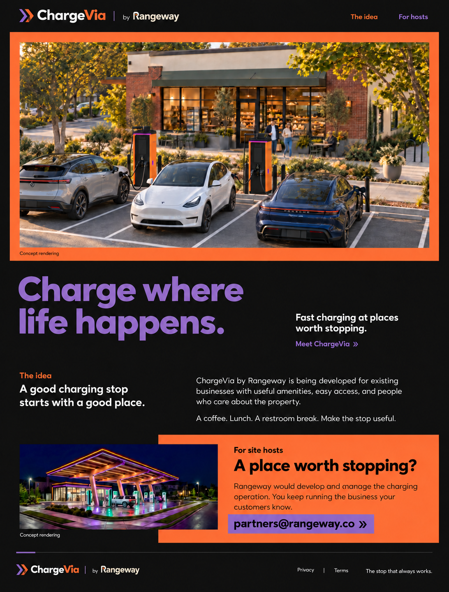

# ChargeVia website redesign

Date: October 4, 2026

Status: Visual direction approved by Zak in this chat. This specification records the approved mockup and makes its responsive behavior, assets, copy, and interactions explicit for review before implementation.

## Purpose and audience

Introduce ChargeVia by Rangeway to drivers first, with a clear invitation for prospective hosts. ChargeVia brings fast charging to existing businesses selected for useful amenities, easy access, property care, and attention to guests. It is a Rangeway product and host-site format.

The site remains a pre-launch introduction. Visitors should understand the idea and the Rangeway relationship, then explore the short explanation or contact Rangeway about a host property.

Current authority: Zak's approval of the orange-framed, purple-headline mockup; the October 3 ChargeVia introduction and host-contact correction in Rangeway HQ; this repository's AGENTS.md; and the maintained Rangeway business and brand sources read during discovery. The newer HQ host-contact correction supersedes older website wording. General and legal inquiries remain at hello@chargevia.net.

## Visual direction

A photo-first composition with a continuous charcoal background, varied spacing, and short, asymmetrical text sections. The photograph supplies the first impression. The typography supports it. Avoid repeated slogan bands, feature-card grids, giant arrows, oversized rounded panels, and a separate final recruitment banner.

The physical references are the existing retail storefront, clear roadside wayfinding, and a concise cafe menu. The context is a driver browsing on a phone between everyday stops, looking for an immediately understandable charging concept. Use dark surfaces to frame the warm photograph and maintain strong contrast.

The approved revision uses a committed orange-and-purple palette:

| Role | Color and treatment |
| --- | --- |
| Page, header, footer | Ink #111111 |
| Main photographic mat | Charge Orange #FF6B35, including the caption margin |
| Headline and main text links | Power Purple #8B6BB4 on ink |
| Idea label | Charge Orange #FF6B35 on ink |
| Host background | Charge Orange #FF6B35, inset beneath the text and slightly behind the night image |
| Host contact action | Power Purple #8B6BB4 with ink text |
| Body copy | White #FFFFFF on ink; ink on orange |
| Wordmarks | Exact source colors; the Rangeway logo retains its approved amber dot |

Use Outfit 700 for headings and Outfit 400 for body copy, with display=swap and Arial fallback. Keep the headline scale near the final mockup, smaller than the initial A. No additional type family or new palette colors. Orange and purple are actual spatial and text roles, not isolated decorative dots.

## Desktop layout and exact homepage copy

1. **Compact masthead.** Retain the existing ChargeVia wordmark, followed by `by` and the approved integrated Rangeway wordmark. Quiet navigation links: `The idea` and `For hosts`. No extra header button.
2. **Main photograph.** The supplied retail-host concept sits immediately below the header, inside an orange mat. Preserve the full storefront and vehicle composition. Caption beneath the image: `Concept rendering` in ink on orange.
3. **Headline.** Purple, left aligned, split after `where`: `Charge where` / `life happens.` The supporting copy sits to the right, aligned near the lower headline line: `Fast charging at places worth stopping.` The nearby text link reads `Meet ChargeVia »`.
4. **The idea.** The smaller left column uses the orange label `The idea` and the statement `A good charging stop starts with a good place.` The wider right column reads: `ChargeVia by Rangeway is being developed for existing businesses with useful amenities, easy access, and people who care about the property.` A second paragraph reads: `A coffee. Lunch. A restroom break. Make the stop useful.`
5. **For site hosts.** Place the existing night concept on the left, with its `Concept rendering` caption. The orange field sits behind the right-hand copy and a small portion of the image. Label: `For site hosts`. Heading: `A place worth stopping?` Body: `Rangeway would develop and manage the charging operation. You keep running the business your customers know.` The purple contact action reads `partners@rangeway.co »`, with ink text.
6. **Quiet footer.** Repeat the exact ChargeVia by Rangeway lockup. Links: `Privacy` and `Terms`. Retain the tagline `The stop that always works.` and a compact copyright line for ChargeVia by Rangeway.

No additional FAQ, process, amenities-card grid, or redundant closing CTA is part of this version. Use semantic headings and sections rather than reproducing the mockup as a flattened image.

## Images and identity assets

- Main source: `/Users/zakwinnick/Downloads/chargevia-intro-concept.png`. Copy into this repository and produce responsive web exports during implementation. Preserve the supplied art; no regeneration or retouching. Alt text: `Concept rendering of electric vehicles charging beside a retail storefront with outdoor seating`.
- Secondary source: existing `public/images/cv-hero-night.jpg`. Alt text: `Concept rendering of a charging stop beneath an illuminated canopy at night`.
- Existing `cv-station-day.jpg` and `cv-urban-night.jpg` remain available in the repository. The approved compact composition does not require adding a gallery.
- Preserve the checked-in ChargeVia logo/wordmark files. Generated mockup lettering and chevrons are illustrative; never trace or substitute them for the actual assets.
- Use the integrated Rangeway wordmark form approved September 7: the stylized R begins the name, followed by angeway. The approved kit PNG is at `/Users/zakwinnick/Documents/Codex/Rangeway/outputs/branding/Rangeway-Brand-Kit-v1/png/rangeway-cream-amber-512.png`; the corresponding outlined vector is at `/Users/zakwinnick/Documents/Codex/Rangeway/outputs/branding/2026-09-07-vector-pass/rangeway-integrated-cream.svg`. Verify the vector matches the approved kit PNG and copy the chosen source into this repository. Do not retain the site's older separate R plus full Rangeway wordmark.
- All rendered site references must resolve to repository assets. The approved mockup is documentation only.

## Mobile and interaction behavior

At 360px and above, use one reading column: compact lockup and two navigation links; orange-framed main photo; purple headline; supporting text and idea link; idea copy; night image; orange host copy and purple contact action; footer. Stack the night image and host field without overlap when it would reduce readability. Keep the main image's full aspect ratio so all vehicles remain understandable. Do not use a horizontal carousel or crop the main scene into a narrow portrait.

Allow the endorsement to sit beneath ChargeVia on narrow screens so both identities remain legible. Keep `The idea` and `For hosts` visible in a simple wrapped navigation row, without a menu drawer. The headline may naturally wrap further on narrow screens. All text, especially the email address, must fit without horizontal page scrolling.

The idea navigation and `Meet ChargeVia »` link target the idea section; the host navigation targets the host section. On legal pages, these target the homepage anchors. The host contact action opens `mailto:partners@rangeway.co`. There is no website form or simulated success state. Privacy and terms retain their existing routes. Provide visible keyboard focus, sufficient touch targets, skip navigation, readable contrast, and reduced-motion support. No decorative entrance animations are required.

## Implementation scope and validation

Retain Astro 6 static generation and the existing shared layout, header, footer, and legal-page structure. Replace the homepage narrative and styles with the approved composition. Refresh shared metadata to remove the old universal covered-stop claim: description `ChargeVia by Rangeway is bringing fast charging to existing businesses with useful amenities, easy access, and people who care.` Retain the approved tagline in the title. Update social imagery to the new retail concept and exact approved identities.

Update the repository's product and design documentation to reflect the driver-first emphasis, orange/purple roles, property-dependent amenities, and partners@rangeway.co host contact. Do not modify the Rangeway operating workspace. Preserve unrelated local work.

Run the repository's Astro checks and production build, inspect the diff, and verify the actual rendered pages on desktop and at 360px and a typical phone width. Check reading order, both wordmarks, image captions, image loading, navigation anchors, email target, legal routes, keyboard focus, text contrast, and horizontal overflow. Measure the built homepage's mobile performance against the existing Lighthouse 95+ target. A successful build alone does not establish visual correctness.

No locations, prices, uptime figures, charger counts, opening dates, named hosts, hardware providers, project economics, financing, rewards, or universal canopy/lounge guarantees enter public copy. The selected images express concept intent rather than an operating-site claim.

Implementation is the next stage after review of this specification. No website code, production deployment, or public publication is completed by this design document. There are no unresolved design choices required to prepare the implementation plan.
